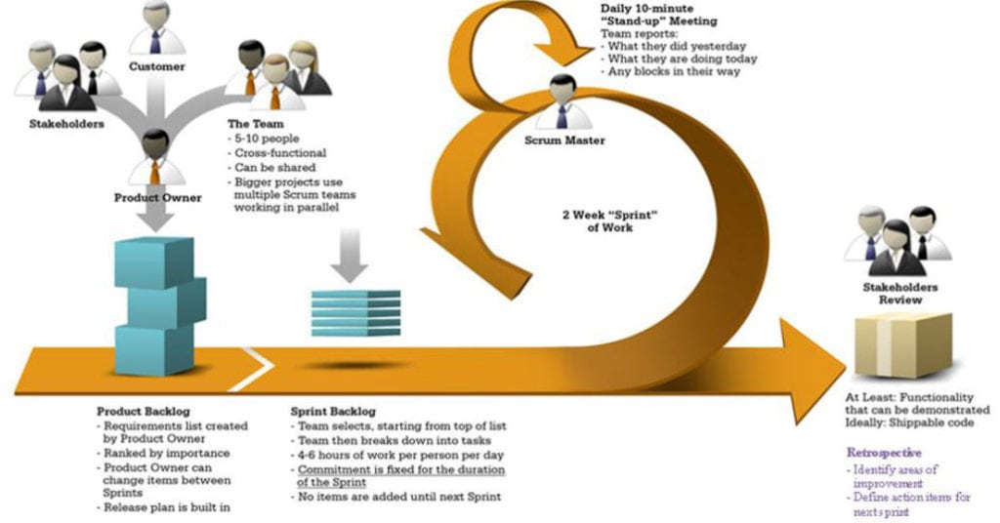
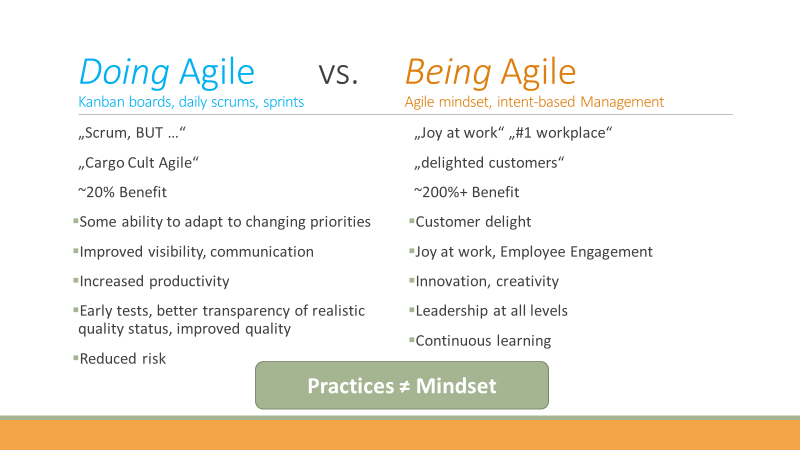
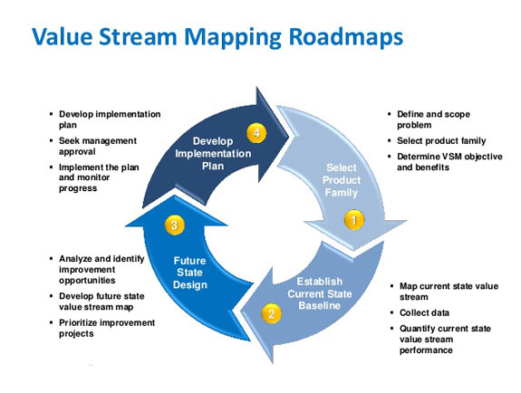
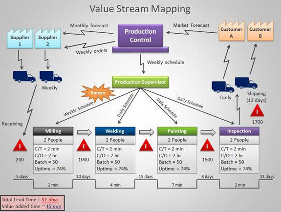

- [1. Agile outside of IT](#1-agile-outside-of-it)
  - [1.1. What is the BANI world and how can it affect your business?](#11-what-is-the-bani-world-and-how-can-it-affect-your-business)
    - [1.1.1. World VUCA](#111-world-vuca)
    - [1.1.2. World BANI](#112-world-bani)
    - [1.1.3. Font](#113-font)
  - [1.2. What's be Agile](#12-whats-be-agile)
  - [1.3. Mindset Agile](#13-mindset-agile)
  - [1.4. Business Agility and Value Stream Mapping](#14-business-agility-and-value-stream-mapping)
    - [1.4.1. Font](#141-font)
  - [1.5. Final tips](#15-final-tips)
- [2. Introduction to Project Management](#2-introduction-to-project-management)

# 1. Agile outside of IT

## 1.1. What is the BANI world and how can it affect your business?

### 1.1.1. World VUCA

- What's VUCA?
  - This acronym is composed by the words "volatile", "uncertain", "complex" and "ambiguous", and was coined in the 80s, during the Cold War period, to explain the adversities of the military universe.
  - At that time, such words still didn"t make as much sense to humanity in general as they do today - where things change in the blink of an eye and technology evolves exponentially.
  - **Volatile**
    - Volatility: Rate of change.
  - **Uncertain**
    - Uncertainty: Unclear about the present.
  - **Complex**
    - Complexity: Multiple key decision factors.
  - **Ambiguous**
    - Lack of clarity about meaning of an event.

### 1.1.2. World BANI

- What's BANI
  - The BANI world is an acronym made up of the words "brittle", "anxious", "nonlinear" and "incomprehensible". The creator of this new concept is Jamais Cascio, American anthropologist, author and futurist.
  - He has written several publications on the future of human evolution, education in the information age and emerging technologies.
  - **Brittle**
    - Brittleness requires: Capacity and resilice.
  - **Anxious**
    - Anxiety asks for: Empathy and mindfulness.
  - **Non-linear**
    - Nonlinearuty calls for: Context and adaptivity.
  - **Incomprehensible**
    - Incomprihensivebility demands: transparency and intuition.

### 1.1.3. Font

- [Vuca and Bani](https://blog.me.com.br/en/o-que-e-o-mundo-bani/)

## 1.2. What's be Agile

- [UMLObjectOrientedDesignOverview](https://github.com/jeftegoes/UMLObjectOrientedDesignOverview#12-the-agile-approach)

  

## 1.3. Mindset Agile

## 1.4. Business Agility and Value Stream Mapping

- **Value Stream Mapping - VSM** is like being in the shoe of a customer.
- **VSM** is a study and separating of VA - Value adding steps/processes from **NVA**.
  - **Non-value (NVA)** adding steps/processes while focusing on the requirements of customer.
- **VSM** will identify potential pain points of the customers and will also trace out exact areas and reasons of wastes.
- These are very **crucial aspect of any organization** that aspires to be on the top of its market.

### 1.4.1. Font

- [Stream Value Mapping](http://www.leanadvantage.in/value-steam-mapping/)
- [Wikipedia](https://en.wikipedia.org/wiki/Value-stream_mapping)

## 1.5. Final tips

- Seek to understand what your customers value.
- Lead by example.
- Reduce or eliminate activities that do not add value to the customer.
- Thank, recognize and reward good behavior.
- Finish the activities that are of the highest value first.
- Make activities visible and value first, constantly monitor.
- Recurring feedback is essential for continuous improvement.
- Work to achieve great relationships with your customers.
- Work as a team and seek multidisciplinarity.
- Team self-organization improves delivery agility and efficiency.
- Fail fast and learn faster.
- Don't make the same mistakes.
- Focus is essential! Wip (work in progress) must be low!!!! Think simple and act fast.
- Align important constraints and expected results.
- Optimize communication.
- Be transparent.
- One team, one goal.
- Explore + experience + adapt.
- Reduce risk by delivering frequently and having the customer always close by.

# 2. Introduction to Project Management

